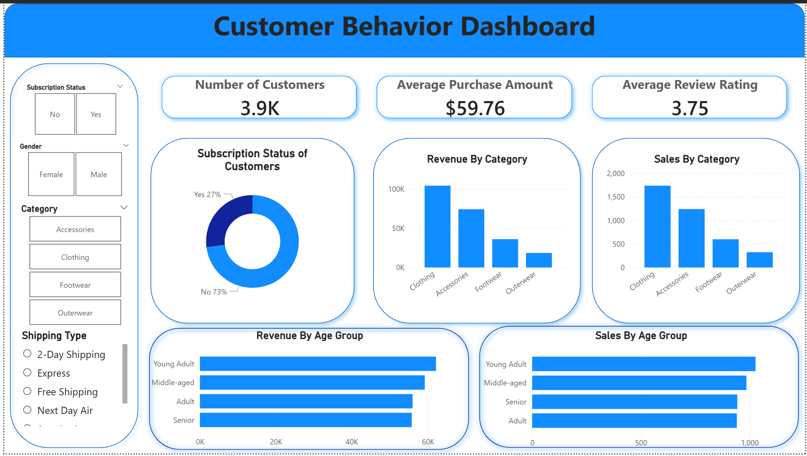

# 🛒 Customer Shopping Behavior Analysis  <br>

<p align="center">
  
</p>

<p align="center">
  
  
  
  
  
  
  
  
</p>

---  

An end-to-end data analytics and business intelligence project that investigates consumer transaction dynamics across 3,900 distinct purchase records. This framework handles data cleaning, relational database storage, advanced multi-variable SQL querying, and interactive dashboard visual reporting to decode customer shopping patterns, evaluate demographics, and uncover critical business metrics.

---

## 📊 Dashboard Preview

  
<br>  

* **Core KPIs Covered**: Total Customer Count (3.9K), Average Purchase Amount ($59.76), and Macro Average Review Rating (3.75).
* **Visual Slicers & Filters**: Subscriptions, Gender, Categories, and Shipping Types to modify metrics dynamically.
* **Deep-Dive Views**: Category Sales Breakdown, Revenue Contributions by Age Tiers, and Subscription Status proportions.

---


## 🏷️ Skills Used

`Python` `SQL` `PostgreSQL` `Power BI` `Data Analytics` `Exploratory Data Analysis (EDA)` `Customer Segmentation` `Retail Analytics` `Feature Engineering` `Jupyter Notebook` `Pandas`

---

## 📌 Project Overview

This project provides an end-to-end data analytics framework to investigate consumer purchase patterns, customer segmentation, subscription impacts, and product performance using a transactional dataset. By combining **Python** for data preparation, **PostgreSQL** for deep transactional business queries, and **Power BI** for visual reporting, this project maps out critical behavioral insights to drive data-driven corporate strategy.

---

## 🎯 Business Objective

The primary focus of this analysis is to:

✅ Identify key spending patterns across core demographics (gender, age group).  
✅ Segment the customer base into distinct lifecycle tiers based on frequency and loyalty markers.  
✅ Evaluate the overall revenue and behavioral impact of store subscription programs.  
✅ Pinpoint product performance, discount dependencies, and customer satisfaction ratings.  
✅ Equip leadership with structural business recommendations to control profit margins and boost retention.  

---


# 🧠 Key Performance Indicators (KPIs)

| KPI | Metric / Context | Insights Derived |
| :--- | :--- | :--- |
| **👥 Total Customer Volume** | **3,900** Purchases | Formulates the statistical base across 4 major retail item categories. |
| **💰 Mean Purchase Amount** | **$59.76** | Establishes the baseline financial order baseline per customer encounter. |
| **⭐ Customer Satisfaction** | **3.75 / 5.00** Rating | Gauges overall feedback after category-specific data imputation. |
| **🧑‍🤝‍🧑 Gender Revenue Split** | **Male:** $157,890 \| **Female:** $75,191 | Discovers volume and conversion variance across buyer segments. |
| **🚛 Shipping Preferences** | **Express** ($60.48) vs. **Standard** ($58.46) | Express shipping users spend roughly 12% more per transaction. |

---  

# 📉 Visualizations Included

* **Bar Charts**: Evaluates total revenue variations across specific age groups and key product styles.
* **Donut/Pie Charts**: Highlights subscription proportions and regional buyer presence.

---

# 🛠️ Tech Stack

| Tool / Technology | Purpose | Key Libraries / Features Used |
| :--- | :--- | :--- |
| **🐍 Python** | Data Processing & Cleaning | `pandas`, `numpy`, `sqlalchemy` |
| **📓 Jupyter Notebook** | Development & Scripting | Step-by-step data engineering sandbox |
| **🐘 PostgreSQL** | Structured Business Queries | Window functions, CTEs (`WITH` clauses), Aggregations |
| **📊 Power BI** | Analytical Dashboard Reporting | Interactive visuals, filtering, and cross-report slicing |

---

# 📂 Project Structure

```bash
Customer-Shopping-Behavior-Analysis/
│
├── Customer_Shopping_Behaviour_Analysis.ipynb     # Python Data Cleaning & PostgreSQL loading script
├── customer_behaviour.sql                         # Database schema exploration & 10 core business queries
├── Customer_Dashboard.pbix                        # Complete Power BI interactive reporting file
├── Customer Shopping Behavior Analysis.docx      # Comprehensive descriptive project document
├── Customer Shopping Behavior Analysis.pdf       # Formatted PDF project documentation
├── Customer-Shopping-Behavior-Analysis.pptx      # High-impact presentation deck for business stakeholders
└── dataset/
    └── customer_shopping_behavior.csv            # Raw transactional baseline dataset (3,900 rows)
```  
# 🔍 Analysis Performed  

## 1️⃣ Data Preparation & Engineering (Python)  
Before executing business computations, data cleaning was orchestrated in a Jupyter Notebook using pandas:

- Missing Value Imputation: Evaluated null parameters and successfully handled 37 missing entries inside the Review Rating column by substituting category-specific median ratings.

- Column Standardization: Structured standard snake_case taxonomy across all 18 attributes to guarantee query compatibility.

- Data Redundancy Auditing: Assessed consistency markers between discount_applied and promo_code_used; dropped the redundant promo_code_used stream.

- Feature Engineering: Binning routines applied to generate an age_group categorizer and computed numerical interval trends (purchase_frequency_days).

- PostgreSQL Loading Pipeline: Formed a programmatic link using sqlalchemy engines to seamlessly push the processed dataframe directly into target database environments.

# 2️⃣ Structured Deep-Dive Queries (PostgreSQL)  

With the database populated, analytical queries were written to extract precise operational indicators:

**Q1: Revenue Generation across Gender**  
```sql
SELECT 
    gender, 
    SUM(purchase_amount) AS revenue
FROM customer
GROUP BY gender;
```
* Output Result: **`Male`** : $157,890  
                 **`Female`** : $75,191
<br><br>  

**Q2: High-Spending Discount Users**  
*Identifies customers optimizing value using promotional strategies but maintaining transactions exceeding the market average price.*
```sql
select customer_id, purchase_amount
from customer
where discount_applied = 'Yes' 
  and purchase_amount >= (select avg(purchase_amount) from customer);
```  
* **Output Result** : `839 Total Qualifying Shoppers`
<br><br>

**Q3: Top 5 Highest Customer Rated Items**  
```sql  
select item_purchased, ROUND(avg(review_rating::numeric), 2) as "Average Product Rating"   
from customer  
group by item_purchased  
order by avg(review_rating) desc  
limit 5;
```
* **Output Result** :
  1. `Gloves`:3.86    
  2. `Sandals`: 3.84
  3. `Boots`:3.82  
  4. `Hats`: 3.80  
  5. `Skirt`:  3.78
<br><br>

**Q4: Logistics & Shipping Purchase Comparisons**  
```sql
select shipping_type, round(avg(purchase_amount),2)  
from customer  
where shipping_type in ('Standard', 'Express')  
group by shipping_type;
```  
* **Output Result** :  
  * `Express`: $60.48 average order  
  * `Standard`: $58.46 average order
<br><br>

**Q5: Financial Impact of Subscription Status**  
```sql
select subscription_status,  
       count(customer_id) as total_customers,  
       round(avg(purchase_amount), 2) as avg_spend,  
       round(sum(purchase_amount), 2) as total_revenue   
from customer  
group by subscription_status  
order by total_revenue, avg_spend desc;
```
* **Output Result** :  
  * `No (Non-Subscribers)`: 2,847 Users | Avg Spend: $59.87 | Revenue: $170,436.00  
  * `Yes (Subscribers)`: 1,053 Users | Avg Spend: $59.49 | Revenue: $62,645.00
<br><br>

**Q6: Top 5 Highest Discount-Dependent Products** 
```sql
select item_purchased,  
       round(count(case when discount_applied = 'Yes' then 1 end)::numeric / count(*), 2) * 100 as discount_rate  
from customer  
group by item_purchased  
order by discount_rate desc  
limit 5;
```
* **Output Result** : `Hat` (50%), `Sneakers` (49.66%), `Coat` (49.07%), `Sweater` (48.17%), `Pants` (47.37%).
<br><br>

**Q7: Customer Segmentation Lifecycle Matrix**  
```sql
with customer_type as (  
    select customer_id, previous_purchases,  
    case  
        when previous_purchases = 1 then 'New'  
        when previous_purchases between 2 AND 10 then 'Returning'  
        else 'Loyal'  
    end as customer_segment  
    from customer  
)  
select customer_segment, count(*) as "Number of Customers"  
from customer_type  
group by customer_segment;  
```
* **Output Result** :  

  * Loyal : 3,116 customers  

  * Returning : 701 customers  

  * New : 83 customers
  <br><br>

**Q8: Top 3 Most Purchased Items Within Each Category**
```sql
with item_counts as (  
    select category, item_purchased, count(customer_id) as total_orders,  
           row_number() over (partition by category order by count(customer_id) desc) as item_rank  
    from customer  
    group by category, item_purchased  
)  
select item_rank, category, item_purchased, total_orders  
from item_counts  
where item_rank <= 3;
```
* Output Highlights: * `Accessories`: Jewelry (171), Sunglasses (161), Belt (161)  

  * `Clothing`: Blouse (171), Pants (171), Shirt (169)  

  * `Footwear`: Sandals (160), Shoes (150), Sneakers (145)  

  * `Outerwear`: Jacket (163), Coat (161)
<br><br>

**Q9: Subscription Conversion Probability of Repeat Buyers**  
*Analyzes if repeat customers with more than 5 previous orders possess higher subscription likelihood.*  
```sql
select subscription_status, count(customer_id) as repeat_buyers  
from customer  
where previous_purchases > 5  
group by subscription_status;
```
* **Output Result** : No: **2,518** Users | Yes: **958** Users
<br><br>

**Q10: Total Revenue Contribution by Demographics**  
```sql
select age_group, sum(purchase_amount) as total_revenue  
from customer  
group by age_group  
order by total_revenue desc;
```
* **Output Result** :

  * `Young Adult` : $62,143

  * `Middle-aged` : $59,197

  * `Adult` : $55,978

  * `Senior` : $55,763
 <br><br>

# 📉 Visualizations Included

✅ **Bar Charts**: Evaluates total revenue variations across specific age groups and key product styles.  
✅ **Donut/Pie Charts**: Highlights subscription proportions and regional buyer presence.  
✅ **Matrix Comparative Layouts**: Interlinks delivery options, shipping types, and individual customer spend parameters.  

---

# 🚀 How to Run the Project

## 1️⃣ Local Replication Setup
```bash
# Clone the project source repository  
git clone [https://github.com/your-username/customer-shopping-analysis.git](https://github.com/your-username/customer-shopping-analysis.git)  
cd customer-shopping-analysis  

# Install processing and analytic libraries  
pip install pandas numpy matplotlib seaborn sqlalchemy psycopg2 jupyter
```

---

## 2️⃣ Execute Python Wrangling Pipeline
1. Boot up your local Python development environment: [`jupyter notebook`](https://jupyter.org/).
2. Open and execute all code cells in [`Customer_Shopping_Behaviour_Analysis.ipynb`](https://github.com/RajayJain/Customer_Shopping_Analysis/blob/43268540456c7c5d56401df357ed44ff124f328e/Resources/Customer_Shopping_Behaviour_Analysis.ipynb) to clean raw transactional logs, perform category-specific median imputation on missing `review_rating` fields, and generate demographic bins.
3. The pipeline will automatically establish a secure local connection via `sqlalchemy` and populate the target database structure.

## 3️⃣ Run SQL Scripts
1. Launch your PostgreSQL database server via pgAdmin or the psql command-line interface.
2. Instantiate a fresh data schema named `customer__behaviour`.
3. Open and run the multi-variable queries contained within [`customer_behaviour.sql`](https://github.com/RajayJain/Customer_Shopping_Analysis/blob/43268540456c7c5d56401df357ed44ff124f328e/Resources/customer_behaviour.sql) to extract the underlying demographic splits, customer segments, and product lifecycle matrices.

## 4️⃣ Explore Power BI Dashboard
1. Ensure **Power BI Desktop** is fully active and updated on your local system.
2. Launch the pre-configured [`Customer_Dashboard.pbix`](https://github.com/RajayJain/Customer_Shopping_Analysis/blob/43268540456c7c5d56401df357ed44ff124f328e/Resources/Customer_Dashboard.pbix) tracking report file.
3. Interact with the live cross-report filters, adjusting categories, subscription flags, and logistics metrics to trace behavioral patterns.

---

# 📈 Insights Generated

📌 **Subscription Paradox**: Non-subscribers account for the majority of customer volume (2,847) and deliver the largest share of gross revenue ($170,436.00) compared to enrolled subscribers ($62,645.00). Average ticket sizing remains highly aligned between the two customer cohorts ($59.87 vs $59.49), indicating subscription status currently lacks average order value (AOV) correlation.  
📌 **Age-Group Performance**: The `Young Adult` demographic stands out as the primary financial driver for the store ($62,143), followed closely by `Middle-aged` shoppers ($59,197), isolating the exact segments to focus on for personalized marketing.  
📌 **Express Shipping Upsell Opportunities**: Selecting express shipping pathways triggers a premium order value average ($60.48) versus standard distribution channels ($58.46), yielding an organic ticket expansion opportunity that can be leveraged at digital checkout.  
📌 **High Promotional Reliance**: Core high-turnover fashion categories like Hats, Sneakers, and Coats demonstrate heavy discount vulnerabilities, with target markdowns applied on up to 50% of all transactions.  

---

# 💡 Future Improvements

🔹 **Demand Forecasting**: Introduce predictive time-series architectures (such as ARIMA or Meta Prophet) to project seasonal inventory strain across apparel categories.  
🔹 **Cloud Automation**: Migrate the local processing scripts to an automated cloud pipeline to dynamically refresh target dashboard datasets.  

---

# 🤝 Connect With Me

## 👨‍💻 Author

**Rajay Jain**

* **📧 Email**: jainrajay2001@gmail.com  
* **💼 LinkedIn**: [www.linkedin.com/in/rajay-ajay-jain-a3abb4168](https://www.linkedin.com/in/rajay-ajay-jain-a3abb4168)  
* **🐙 GitHub**: [https://github.com/RajayJain](https://github.com/RajayJain)  

---

## ⭐ Support

If you find this analysis framework resourceful or helpful for your retail applications, please consider giving this project repository a ⭐ on GitHub!

---

<p align="center">
  Made with ❤️ using Python, SQL & Power BI
</p>
